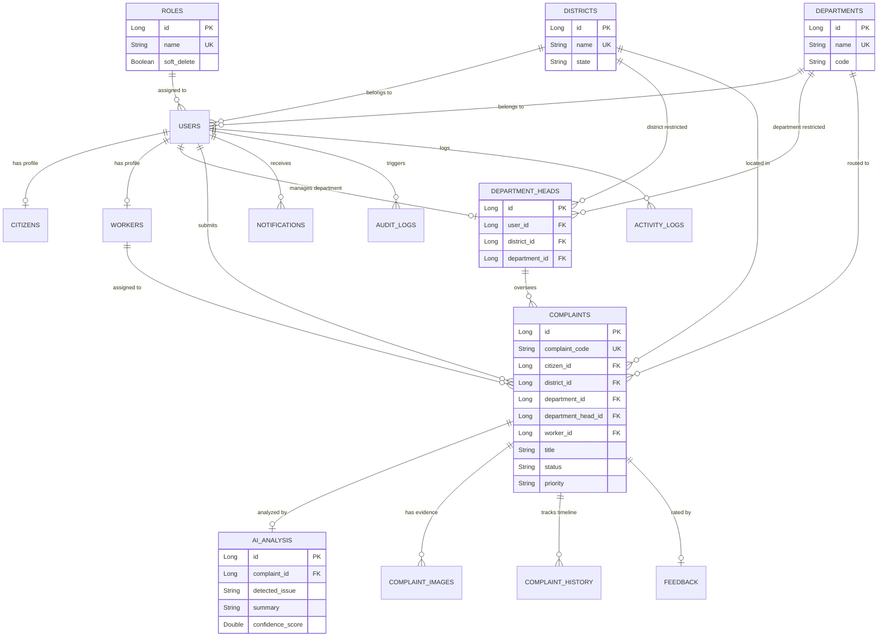

# Civic Issue Reporting Platform - Entity Relationship Diagram

```mermaid
erDiagram
    ROLES ||--o{ USERS : "assigned to"
    DISTRICTS ||--o{ USERS : "belongs to"
    DEPARTMENTS ||--o{ USERS : "belongs to"
    
    USERS ||--o| CITIZENS : "has profile"
    USERS ||--o| WORKERS : "has profile"
    USERS ||--o| DEPARTMENT_HEADS : "manages department"

    DISTRICTS ||--o{ DEPARTMENT_HEADS : "district restricted"
    DEPARTMENTS ||--o{ DEPARTMENT_HEADS : "department restricted"

    USERS ||--o{ COMPLAINTS : "submits"
    DISTRICTS ||--o{ COMPLAINTS : "located in"
    DEPARTMENTS ||--o{ COMPLAINTS : "routed to"
    DEPARTMENT_HEADS ||--o{ COMPLAINTS : "oversees"
    WORKERS ||--o{ COMPLAINTS : "assigned to"

    COMPLAINTS ||--o| AI_ANALYSIS : "analyzed by"
    COMPLAINTS ||--o{ COMPLAINT_IMAGES : "has evidence"
    COMPLAINTS ||--o{ COMPLAINT_HISTORY : "tracks timeline"
    COMPLAINTS ||--o| FEEDBACK : "rated by"

    USERS ||--o{ NOTIFICATIONS : "receives"
    USERS ||--o{ AUDIT_LOGS : "triggers"
    USERS ||--o{ ACTIVITY_LOGS : "logs"

    ROLES {
        Long id PK
        String name UK
        Boolean soft_delete
    }

    DISTRICTS {
        Long id PK
        String name UK
        String state
    }

    DEPARTMENTS {
        Long id PK
        String name UK
        String code
    }

    DEPARTMENT_HEADS {
        Long id PK
        Long user_id FK
        Long district_id FK
        Long department_id FK
    }

    COMPLAINTS {
        Long id PK
        String complaint_code UK
        Long citizen_id FK
        Long district_id FK
        Long department_id FK
        Long department_head_id FK
        Long worker_id FK
        String title
        String status
        String priority
    }

    AI_ANALYSIS {
        Long id PK
        Long complaint_id FK
        String detected_issue
        String summary
        Double confidence_score
    }
```
